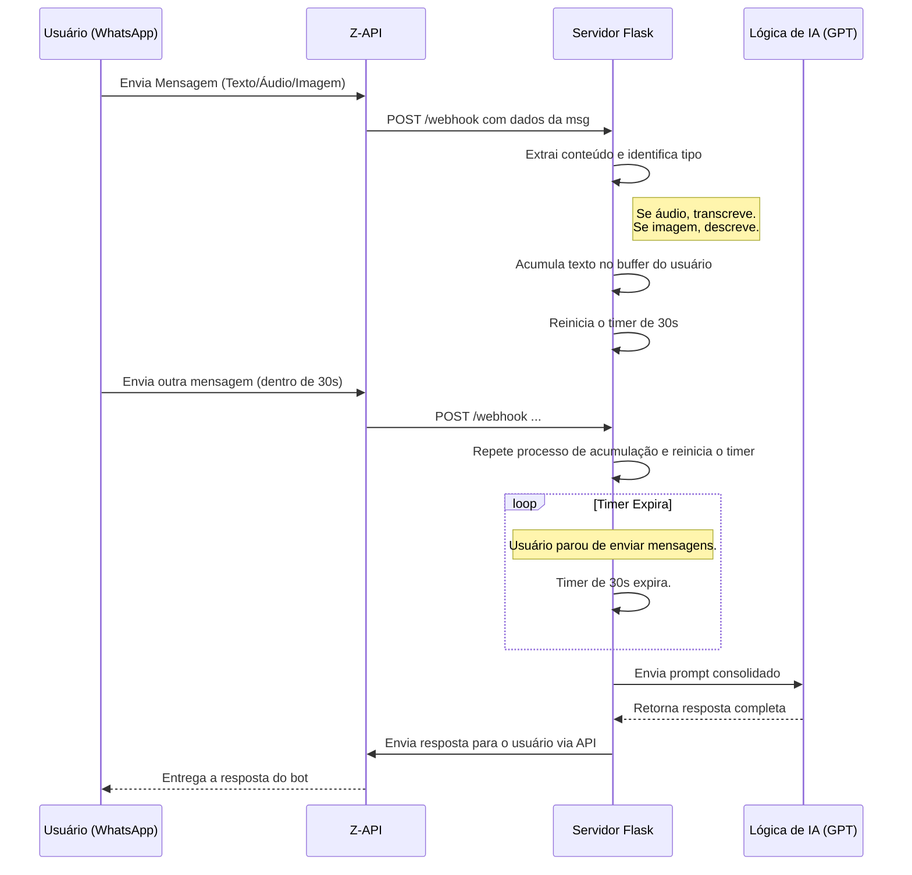

<body>
    <div class="container">
        
        <div class="center-div">
            <a href="https://z-api.io/">
                
            </a>
        </div>
        
        <h1>Chatbot Inteligente com Acumulador de Mensagens</h1>

        <p class="center-div">
            <strong>Um backend robusto para WhatsApp que agrupa mensagens de texto, áudio e imagem para gerar respostas de IA mais ricas e contextuais.</strong>
        </p>

        <div class="badges">
            <p>
                
                
                
                
            </p>
        </div>

        <hr>

        <h2>📋 Índice</h2>
        <ul>
            <li><a href="#visao-geral"><strong>Visão Geral</strong></a></li>
            <li><a href="#arquitetura"><strong>Arquitetura do Sistema</strong></a></li>
            <li><a href="#como-funciona"><strong>Como Funciona: O Fluxo de uma Conversa</strong></a></li>
            <li><a href="#instalacao"><strong>Guia de Instalação e Configuração</strong></a></li>
            <li><a href="#customizacao"><strong>Customização e Extensibilidade</strong></a></li>
            <li><a href="#melhorias"><strong>Melhorias Futuras</strong></a></li>
            <li><a href="#licenca"><strong>Licença</strong></a></li>
            <li><a href="#markdown-source"><strong>Código Fonte Markdown</strong></a></li>
        </ul>

        <hr>

        <h2 id="visao-geral">🎯 Visão Geral</h2>
        <p>Este projeto implementa um serviço de backend para um chatbot de WhatsApp que se destaca por sua capacidade de <strong>acumular mensagens de forma inteligente</strong>. Em vez de responder reativamente a cada interação, o sistema aguarda uma pausa na conversa do usuário para consolidar múltiplas mensagens — incluindo texto, áudios transcritos e descrições de imagens — em um único prompt contextual.</p>
        <p>Este prompt unificado permite que modelos de linguagem (LLMs) como o GPT-4 gerem respostas muito mais coesas, precisas e humanizadas, transformando interações fragmentadas em um diálogo fluido.</p>
        
        <h3>🌟 Objetivo do Projeto</h3>
        <p>O principal objetivo é superar a limitação de chatbots tradicionais que processam cada mensagem isoladamente. Ao criar um "buffer de contexto", o bot pode entender a intenção completa do usuário, mesmo que ela seja expressa em várias partes, resultando em uma experiência de usuário drasticamente superior.</p>

        <h3>✨ Principais Funcionalidades</h3>
        <ul>
            <li><strong>Acumulador de Mensagens:</strong> Consolida mensagens enviadas em um curto intervalo de tempo.</li>
            <li><strong>Suporte Multimodal Completo:</strong>
                <ul>
                    <li>💬 <strong>Texto:</strong> Processa mensagens de texto padrão.</li>
                    <li>🎤 <strong>Áudio:</strong> Transcreve automaticamente mensagens de voz para texto usando <strong>OpenAI Whisper</strong>.</li>
                    <li>🖼️ <strong>Imagem:</strong> Gera descrições textuais de imagens enviadas usando <strong>GPT-4 Vision</strong>.</li>
                    <li>📹 <strong>Vídeo:</strong> Reconhece o recebimento de vídeos e captura suas legendas.</li>
                </ul>
            </li>
            <li><strong>Temporizador Dinâmico:</strong> Um temporizador reinicia a cada nova mensagem, acionando a resposta apenas quando o usuário faz uma pausa.</li>
            <li><strong>Arquitetura Flexível:</strong> Projetado para ser independente da API de envio, permitindo fácil adaptação a qualquer serviço de mensageria (Telegram, Messenger, etc.).</li>
            <li><strong>Segurança de Concorrência:</strong> Utiliza <code>threading.Lock</code> para garantir o processamento seguro e sem conflitos de mensagens de múltiplos usuários simultâneos.</li>
        </ul>

        <hr>

        <h2 id="arquitetura">🏗️ Arquitetura do Sistema</h2>
        <p>O sistema é construído sobre uma base de Python e Flask, com uma arquitetura simples, porém poderosa, focada em modularidade e performance.</p>

        <hr>

        <h2 id="como-funciona">🚀 Como Funciona: O Fluxo de uma Conversa</h2>
        <ol>
            <li><strong>Recepção:</strong> O endpoint <code>/webhook</code> recebe uma notificação da Z-API.</li>
            <li><strong>Processamento:</strong> O conteúdo é extraído. Se for uma mídia, é baixada e convertida para texto (transcrição ou descrição).</li>
            <li><strong>Acumulação Segura:</strong> Usando um <code>lock</code>, o sistema adiciona o novo texto ao buffer do usuário correspondente.</li>
            <li><strong>Gerenciamento do Timer:</strong> Qualquer timer anterior para aquele usuário é <strong>cancelado</strong> e um novo é <strong>iniciado</strong>. Este passo é crucial para garantir que o bot só responda após a última mensagem de uma sequência.</li>
            <li><strong>Expiração e Ação:</strong> Quando o usuário para de interagir, o timer expira. A função <code>on_timer_expire</code> é chamada.</li>
            <li><strong>Geração da Resposta:</strong> A mensagem consolidada é enviada para a função <code>responder_usuario</code>, onde a lógica de IA é aplicada.</li>
            <li><strong>Envio:</strong> A resposta final é enviada ao usuário através da API do Zapi.</li>
        </ol>

        <hr>

        <h2 id="instalacao">🛠️ Guia de Instalação e Configuração</h2>
        <p>Siga estes passos para colocar o chatbot em funcionamento.</p>

        <h3>✅ Pré-requisitos</h3>
        <ul>
            <li>Python 3.8 ou superior</li>
            <li>Conta na plataforma <strong>Z-API</strong> com credenciais de API.</li>
            <li>Chave de API da <strong>OpenAI</strong>.</li>
            <li><code>ngrok</code> (para exposição do webhook em ambiente de desenvolvimento).</li>
        </ul>
        
        <hr>

        <h2 id="customizacao">🎨 Customização e Extensibilidade</h2>
        
        <h3>🧠 Implementando a Lógica da IA</h3>
        <p>O coração da sua inteligência está na função <code>responder_usuario</code>. É aqui que você define a "personalidade" e a capacidade do seu bot.</p>
        
        <h3>🔌 Adaptando para Outras Plataformas</h3>
        <p>A lógica de acumulação, timers e concorrência <strong>permanece 100% reutilizável</strong>. Para migrar para o Telegram, por exemplo, você só precisa alterar a recepção dos dados e a função de envio.</p>

        <hr>

        <h2 id="melhorias">📈 Melhorias Futuras</h2>
        <ul>
            <li><strong>Persistência de Dados:</strong> Migrar os dicionários em memória para um banco de dados como <strong>Redis</strong>.</li>
            <li><strong>Gerenciamento de Histórico:</strong> Armazenar conversas passadas para fornecer um contexto ainda mais longo à IA.</li>
            <li><strong>Filas de Processamento:</strong> Para um alto volume, usar <strong>RabbitMQ</strong> ou <strong>Celery</strong>.</li>
            <li><strong>Dashboard de Monitoramento:</strong> Criar uma interface web para visualizar conversas em tempo real.</li>
        </ul>

        <hr>

        <h2 id="licenca">📜 Licença</h2>
        <p>Este projeto está sob a licença MIT. Veja o arquivo <code>LICENSE</code> para mais detalhes.</p>
        
        <hr>

        <h2 id="markdown-source">📄 Código Fonte Markdown</h2>
        <p>Abaixo está o código-fonte completo em Markdown desta documentação, pronto para ser usado no <code>README.md</code> do seu projeto.</p>
        
        <div class="code-container">
            <button class="copy-button">Copiar Código</button>
            <pre><code id="markdown-code"><div align="center">
  <a href="https://z-api.io/">
    
  </a>
</div>

<h1 align="center">Chatbot Inteligente com Acumulador de Mensagens</h1>

<p align="center">
  <strong>Um backend robusto para WhatsApp que agrupa mensagens de texto, áudio e imagem para gerar respostas de IA mais ricas e contextuais.</strong>
</p>

<p align="center">
  
  
  
  
</p>

---

## 📋 Índice

1.  [**Visão Geral**](#-visão-geral)
    *   [Objetivo do Projeto](#-objetivo-do-projeto)
    *   [Principais Funcionalidades](#-principais-funcionalidades)
2.  [**Arquitetura do Sistema**](#-arquitetura-do-sistema)
    *   [Diagrama de Fluxo](#-diagrama-de-fluxo)
    *   [Componentes Chave](#-componentes-chave)
3.  [**Como Funciona: O Fluxo de uma Conversa**](#-como-funciona-o-fluxo-de-uma-conversa)
4.  [**Guia de Instalação e Configuração**](#-guia-de-instalação-e-configuração)
    *   [Pré-requisitos](#-pré-requisitos)
    *   [Passos de Instalação](#-passos-de-instalação)
    *   [Configurando o Ambiente](#-configurando-o-ambiente)
    *   [Executando o Servidor](#-executando-o-servidor)
5.  [**Customização e Extensibilidade**](#-customização-e-extensibilidade)
    *   [Implementando a Lógica da IA](#-implementando-a-lógica-da-ia)
    *   [Adaptando para Outras Plataformas](#-adaptando-para-outras-plataformas)
6.  [**Melhorias Futuras**](#-melhorias-futuras)
7.  [**Licença**](#-licença)

---

## 🎯 Visão Geral

Este projeto implementa um serviço de backend para um chatbot de WhatsApp que se destaca por sua capacidade de **acumular mensagens de forma inteligente**. Em vez de responder reativamente a cada interação, o sistema aguarda uma pausa na conversa do usuário para consolidar múltiplas mensagens — incluindo texto, áudios transcritos e descrições de imagens — em um único prompt contextual.

Este prompt unificado permite que modelos de linguagem (LLMs) como o GPT-4 gerem respostas muito mais coesas, precisas e humanizadas, transformando interações fragmentadas em um diálogo fluido.

### 🌟 Objetivo do Projeto

O principal objetivo é superar a limitação de chatbots tradicionais que processam cada mensagem isoladamente. Ao criar um "buffer de contexto", o bot pode entender a intenção completa do usuário, mesmo que ela seja expressa em várias partes, resultando em uma experiência de usuário drasticamente superior.

### ✨ Principais Funcionalidades

*   **Acumulador de Mensagens:** Consolida mensagens enviadas em um curto intervalo de tempo.
*   **Suporte Multimodal Completo:**
    *   💬 **Texto:** Processa mensagens de texto padrão.
    *   🎤 **Áudio:** Transcreve automaticamente mensagens de voz para texto usando **OpenAI Whisper**.
    *   🖼️ **Imagem:** Gera descrições textuais de imagens enviadas usando **GPT-4 Vision**.
    *   📹 **Vídeo:** Reconhece o recebimento de vídeos e captura suas legendas.
*   **Temporizador Dinâmico:** Um temporizador reinicia a cada nova mensagem, acionando a resposta apenas quando o usuário faz uma pausa.
*   **Arquitetura Flexível:** Projetado para ser independente da API de envio, permitindo fácil adaptação a qualquer serviço de mensageria (Telegram, Messenger, etc.).
*   **Segurança de Concorrência:** Utiliza `threading.Lock` para garantir o processamento seguro e sem conflitos de mensagens de múltiplos usuários simultâneos.

---

## 🏗️ Arquitetura do Sistema

O sistema é construído sobre uma base de Python e Flask, com uma arquitetura simples, porém poderosa, focada em modularidade e performance.

### 🌊 Diagrama de Fluxo



### 🧩 Componentes Chave

*   **`app.py` (Servidor Flask):** O núcleo da aplicação. Recebe webhooks, gerencia o estado da aplicação (mensagens e timers) e orquestra todo o fluxo.
*   **`funcoes_chatgpt.py`:** Módulo responsável pela interação com as APIs da OpenAI (Whisper para transcrição, GPT-4V para visão, e o LLM para geração de respostas).
*   **`funcao_envio.py`:** Abstrai a comunicação com a API do Zapi para enviar mensagens de volta ao usuário.
*   **Dicionários de Estado em Memória:**
    *   `accumulated_messages`: Armazena o contexto da conversa de cada usuário.
    *   `active_timers`: Mantém referência aos timers ativos para poder cancelá-los.
    *   `processing_lock`: Garante a integridade dos dados em operações concorrentes.

---

## 🚀 Como Funciona: O Fluxo de uma Conversa

1.  **Recepção:** O endpoint `/webhook` recebe uma notificação da Z-API.
2.  **Processamento:** O conteúdo é extraído. Se for uma mídia, é baixada e convertida para texto (transcrição ou descrição).
3.  **Acumulação Segura:** Usando um `lock`, o sistema adiciona o novo texto ao buffer do usuário correspondente.
4.  **Gerenciamento do Timer:** Qualquer timer anterior para aquele usuário é **cancelado** e um novo é **iniciado**. Este passo é crucial para garantir que o bot só responda após a última mensagem de uma sequência.
5.  **Expiração e Ação:** Quando o usuário para de interagir, o timer expira e executa a função de callback `on_timer_expire`.
6.  **Chamada da Lógica Principal:** A função `on_timer_expire` consolida todas as mensagens acumuladas em uma única string e a passa para a função `responder_usuario`.
7.  **Geração e Envio da Resposta:** `responder_usuario` utiliza a string completa para interagir com a IA, gerar uma resposta coesa e, finalmente, chama a função `enviar_mensagem_zapi_com_delaytyping` para entregar a resposta ao usuário.

---

## 🛠️ Guia de Instalação e Configuração

### ✅ Pré-requisitos

*   Python 3.8+
*   Conta na plataforma Z-API com as credenciais.
*   Chave de API da OpenAI.

### ⚙️ Passos de Instalação

1.  **Clone o repositório.**
2.  **Crie e ative um ambiente virtual.**
3.  **Crie um arquivo `requirements.txt`:**
    ```txt
    flask
    requests
    openai
    openai-whisper
    python-dotenv
    ```
4.  **Instale as dependências:**
    ```bash
    pip install -r requirements.txt
    ```

### 🔑 Configurando o Ambiente

1.  **Crie um arquivo `.env`** com suas credenciais:
    ```env
    # Credenciais da OpenAI
    OPENAI_API_KEY="sk-..."

    # Credenciais da Z-API
    ZAPI_API_URL="https://api.z-api.io/instances/..."
    ZAPI_TOKEN="SeuTokenAqui"
    ```

---

## 🎨 Customização e Extensibilidade

A lógica central do seu bot está na função `responder_usuario`. Adapte-a para definir a personalidade e as capacidades de resposta. A arquitetura modular permite trocar a API de envio (Z-API) por qualquer outra (Telegram, etc.) com alterações mínimas.

---

## 📈 Melhorias Futuras

*   **Persistência de Dados:** Usar **Redis** para salvar o estado da conversa.
*   **Gerenciamento de Histórico:** Salvar conversas em um banco de dados para contextos mais longos.
*   **Filas de Processamento:** Usar **RabbitMQ** ou **Celery** para escalar o processamento de IA.
*   **Dashboard de Monitoramento:** Criar uma interface para visualizar logs e conversas.

---

## 📜 Licença

Este projeto está sob a licença MIT.
</code></pre>
        </div>
    </div>
    <script>
        document.querySelector('.copy-button').addEventListener('click', function() {
            const codeToCopy = document.getElementById('markdown-code').innerText;
            navigator.clipboard.writeText(codeToCopy).then(() => {
                this.innerText = 'Copiado!';
                this.style.backgroundColor = '#28a745'; // Green color for success
                setTimeout(() => {
                    this.innerText = 'Copiar Código';
                    this.style.backgroundColor = '#007bff'; // Revert to original color
                }, 2000);
            }).catch(err => {
                console.error('Falha ao copiar o texto: ', err);
                this.innerText = 'Erro!';
                this.style.backgroundColor = '#dc3545'; // Red color for error
                 setTimeout(() => {
                    this.innerText = 'Copiar Código';
                    this.style.backgroundColor = '#007bff';
                }, 2000);
            });
        });
    </script>
</body>
</html>
